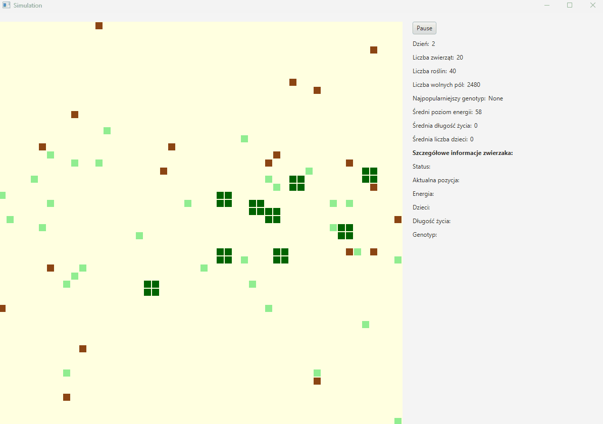
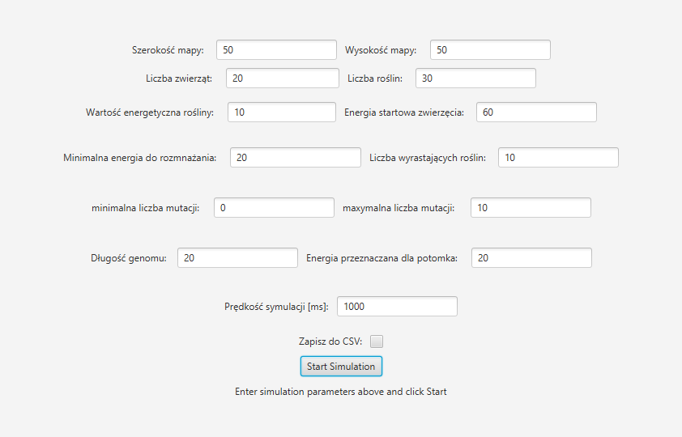
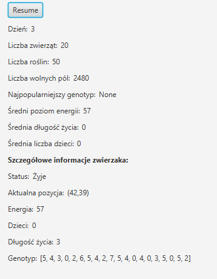

# PO_project_2024

An evolutionary simulation project focusing on natural selection. Organisms compete for limited resources to survive and reproduce. Users are able to observe the ecosystem and have access to some statistics of individual creatures.

## Features
+ Map represented as a grid with edible plants
+ Ability to run multiple simulations in separate threads
+ Overview of creature statistics
+ Capability to save stats in CSV file
+ Configurable properties of simulation
+ Animal behaviour:
    + 8 directions to move determined by genes
    + Energy decreases after a move
    + Reproduction when creatures have enough energy with gene crossover and mutation.

## Animal move
+ New position calculation
+ Change position if it is possible
+ Consuming plant
+ Decreasing energy
+ Dead animal removal

Reproduction is processed after all creatures move for choosing the two strongest animals (the highest energy rate)

## Demo and Screenshots



### App menu


### Simulation and exact animal stats


## Tech stack


## How to run the project
```bash
git clone https://github.com/Lynxman21/PO_project_2024.git
cd PO_project_2024
./gradlew run
```

## Authors
+ Mateusz Ryś
+ Emil Siatka
